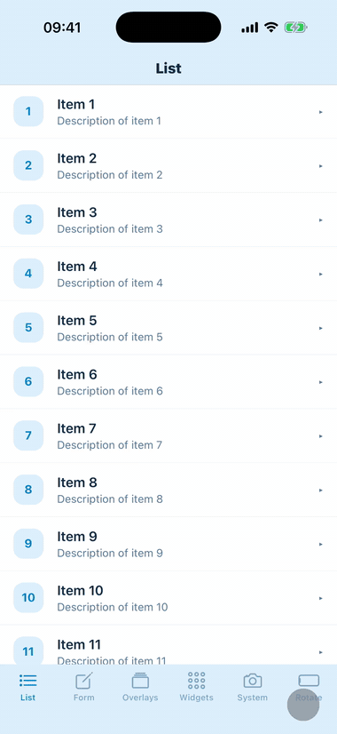

# react-native-one-hand — example app

Demo app for [`react-native-one-hand`](https://github.com/Filipmok-agh/react-native-one-hand) — a library that scales the
**entire app**, including native modals, alerts and third-party overlays, into a bottom
corner so everything stays reachable with one thumb. This app is a playground of surfaces
worth watching while docked: native overlays, system pickers, gestures and animations.

<p align="center">
  
</p>

## Running

A native dev build is required (the library is a native module — it won't work in Expo Go):

```bash
npm install
npm run ios       # or: npm run android
```

Once the app is built, `npm start` (Metro only) is enough for subsequent runs.

**Controls:** press and hold a bottom corner (~0.5 s) to enter one-hand mode on that side;
tap the backdrop around the docked app to exit.

## Screens

Each tab exercises a different class of surface while the app is docked:

- **List** — a scrollable `FlashList` with tappable, removable rows: plain scrolling and
  touch inside the docked app.
- **Form** — text inputs with a keyboard: shows the keyboard policy (opening the keyboard
  exits the mode; entering the mode is blocked while typing).
- **Overlays** — native `Modal`, `Alert.alert`, `ActionSheetIOS`, `react-native-modal`, a
  @gorhom bottom sheet, a Paper `Dialog` portal, an in-tree Snackbar, and two iOS-only
  special windows: `FullWindowOverlay` and a separate banner window created by a local
  native module.
- **Widgets** — the text-selection toolbar, native date/time picker dialogs (Android), an
  anchored menu popup, and native fullscreen video (`expo-video`).
- **System** — camera, photo picker, document picker, share sheet and the calendar event
  editor: system surfaces, some living in other processes or activities.
- **Rotate** — orientation locks (`expo-screen-orientation`) for the portrait-only
  policy: the mode refuses to start in landscape and auto-exits on rotation.
